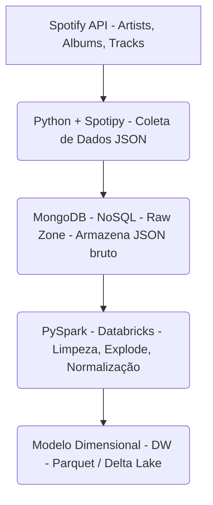
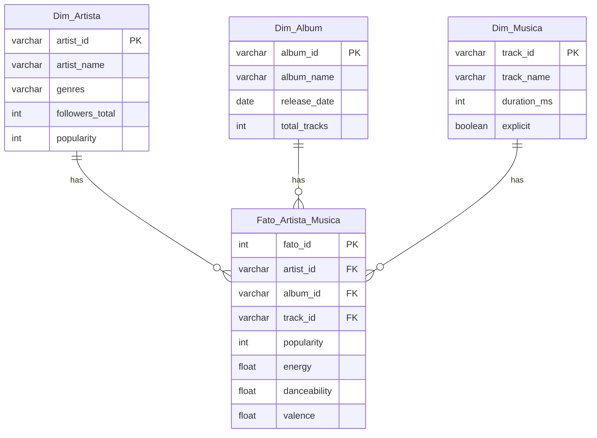

# 🎵 Pipeline de Engenharia de Big Data com API do Spotify

Pipeline completo para coleta, armazenamento, transformação e modelagem dimensional de dados da API do Spotify utilizando **Python**, **PySpark**, **MongoDB** e **Databricks**.

<br>

## 📌 1. Objetivo do Projeto

*   Construir um pipeline que consuma a API do Spotify.
*   Armazenar os dados em **MongoDB** (NoSQL).
*   Realizar transformação com **PySpark** (Databricks).
*   Estruturar um **modelo dimensional analítico**.

<br>

## 🗂️ 2. Arquitetura do Pipeline

### Diagrama Geral da Arquitetura



<br>

## 🔐 3. Obtenção das Credenciais (API Spotify e MongoDB)

### Passo 1 — Criar App (Spotify)

1.  Acesse o [Spotify Developer Dashboard](https://developer.spotify.com/dashboard).
2.  Clique em "Create App".
3.  Copie o `CLIENT_ID` e o `CLIENT_SECRET`.

### Passo 2 - Criar Collection (MongoDB)
1. Acesse o [MongoDB](https://www.mongodb.com/).
2. Selecione seu Cluster.
3. Crie ou Acesse um Database.
4. Crie uma nova Collection.
5. Clique em "Conectar" e Selecione a Primeira Opção.
6. Copie o `MONGODB_URI`, `MONGODB_DATABASE`,`MONGODB_COLLECTION`.

### Passo 3 — Configurar `.env`

Crie um arquivo `.env` e preencha com suas credenciais:

```dotenv
SPOTIFY_CLIENT_ID=SEU_CLIENT_ID
SPOTIFY_CLIENT_SECRET=SEU_CLIENT_SECRET
MONGODB_URI=mongodb://localhost:27017
MONGODB_DB=NOME_DATABASE
MONGODB_COLLECTION=NOME_COLLECTION
```

<br>

## 🧱 4. Estrutura do Projeto

A estrutura de diretórios do projeto é a seguinte:

```
spotify-big-data-main/
├── README.md
├── requirements.txt
├── .env.example
└── src/
    └── collection/
        ├── __init__.py
        └── connect_spotify.py
```

<br>

## 🗃️ 5. Esquema do Banco NoSQL (MongoDB)

O documento armazenado na **Raw Zone** do MongoDB segue uma estrutura aninhada, conforme o exemplo abaixo:

```json
{
  "artist_name": "Taylor Swift",
  "artist_id": "06HL4z0CvFAxyc27GXpf02",
  "artist_info": {
      "genres": ["..."],
      "followers": { "total": 10229300 },
      "popularity": 92
  },
  "albums": [
      {
        "album_id": "...",
        "album_name": "...",
        "release_date": "...",
        "tracks": [
            {
               "track_id": "...",
               "track_name": "...",
               "duration_ms": 193020
            }
        ]
      }
  ],
}
```

<br>

## 🐍 6. Scripts de Coleta (Python)

O script `src/collection/connect_spotify.py` é responsável pela coleta de dados.

### Autenticação

Utiliza o `spotipy` para autenticação:

```python
from spotipy.oauth2 import SpotifyClientCredentials
import os
import spotipy

credentials = SpotifyClientCredentials(
    client_id=os.getenv("SPOTIFY_CLIENT_ID"),
    client_secret=os.getenv("SPOTIFY_CLIENT_SECRET")
)
sp = spotipy.Spotify(client_credentials_manager=credentials)
```

### Conexão e Inserção no MongoDB

```python
from pymongo import MongoClient

mongo_client = MongoClient(os.getenv("MONGODB_URI"))
collection = mongo_client["spotify"]["raw_data"]

# ... coleta de dados ...

# Inserção no MongoDB
collection.insert_one(data)
```

### Coleta por Artista

A coleta é realizada para uma lista pré-definida de artistas:

```python
ARTIST_URIs_TO_FETCH = {
    "Taylor Swift": "spotify:artist:06HL4z0CvFAxyc27GXpf02",
    "Dua Lipa": "spotify:artist:6M2wZ9GZgrQXHCFfjv46we",
    "Imagine Dragons": "spotify:artist:53XhwfbYqKCa1cC15pYq2q",
    # ... outros artistas ...
}
```

<br>

## 🔄 7. ETL com PySpark (Databricks)

O processo de ETL (Extração, Transformação e Carga) é executado no Databricks, utilizando o notebook `projeto eixo temático 5 - BD.ipynb`.

### Fluxo ETL

O fluxo de transformação segue as seguintes etapas:

1.  **MongoDB (raw JSON)**: Leitura dos dados brutos.
2.  **PySpark**:
    *   Leitura dos dados.
    *   `Explode` de listas (ex: álbuns, faixas).
    *   Normalização de colunas.
    *   Limpeza e `cast` de tipos.
3.  **Data Warehouse Dimensional**: Escrita final dos dados transformados.

### Exemplo de Operações PySpark

**Carregar dados do MongoDB:**

```python
df_raw = spark.read.format("mongo") \
        .option("uri", "mongodb://.../spotify.raw_data") \
        .load()
```

**Normalização (Seleção de colunas de Artista):**

```python
df_artists = df_raw.select(
    "artist_id",
    "artist_name",
    "artist_info.followers.total",
    "artist_info.genres",
    "artist_info.popularity"
)
```

**Explosão (Álbuns):**

```python
import pyspark.sql.functions as F

df_albums = df_raw.withColumn("album", F.explode("albums"))
```

**Escrita Final (Parquet/Delta Lake):**

```python
df_clean.write.format("parquet").mode("overwrite").save("/mnt/datalake/clean/albums")
```

<br>

## 🧩 8. Modelo Dimensional

O modelo dimensional implementado é um **Star Schema**, conforme o `Termo de Abertura`.

### Diagrama Dimensional (Star Schema)



<br>

## 📦 9. Requisitos

As dependências necessárias para a execução do projeto estão listadas no arquivo `requirements.txt`:

```
spotipy
pymongo
python-dotenv
pyspark
```

<br>

## ▶️ 10. Execução

Siga os passos abaixo para executar o pipeline:

1.  **Criar arquivo de variáveis de ambiente (`.env`):**
    ```bash
    cp .env.example .env
    # Edite o arquivo .env com suas credenciais
    ```

2.  **Executar a coleta de dados (Python):**
    ```bash
    python src/collection/connect_spotify.py
    ```

3.  **Rodar o ETL no Databricks:**
    *   Importe o notebook `projeto eixo temático 5 - BD.ipynb` para o seu workspace no Databricks.
    *   Execute as células do notebook para processar os dados do MongoDB e gerar o Modelo Dimensional.

<br>

## 📊 11. Critérios de Sucesso

Os critérios utilizados para considerar o projeto bem-sucedido, conforme o `Termo de Abertura`, são:

*   **Integração funcional** com a API do Spotify.
*   **Estruturação completa** do modelo dimensional.
*   **Dataset analítico** consultável e documentado.
